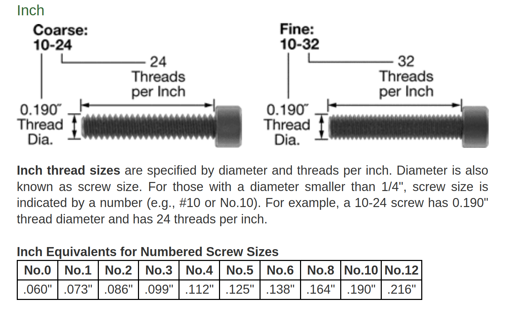
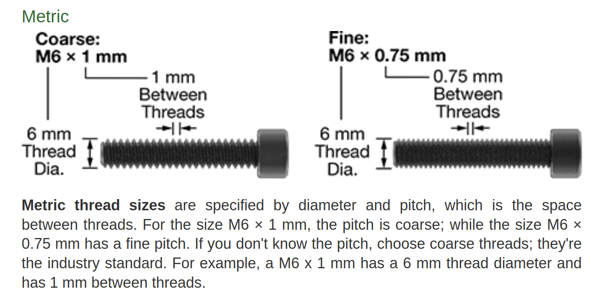
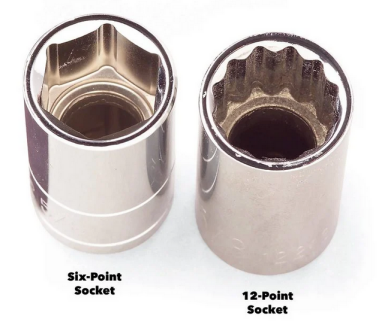

# The Nuts & Bolts of Screws

----------------------------------------

## 1. How screw sizes are designated: Imperial and Metric


----------------------------------------

## 2. How to measure screw sizes: Imperial and Metric


* From <a href="https://www.mcmaster.com/info/how-to-measure-screw-thread-size.html" target="_blank">McMaster-Carr</a>



```
Handy Tip: SCREW_NUMBER_SIZE x 0.013" + 0.060" = SCREW_DIAMETER
```



----------------------------------------

## 3. How Torque Works:


### Chart showing <a href="https://www.pencomsf.com/articles-updates/screw-torque-reference/" target="_blank">proper torque for various screw sizes</a>


----------------------------------------

## 4. Screw Head styles and their drivers:


### Hex head




----------------------------------------

## 5. Specialty hardware:

### Nyloc Nuts - Stay in place without needing to be tightened


### PEM Nuts - Press in nuts for sheet metal


----------------------------------------

## Additional links:

* <a href="https://en.wikipedia.org/wiki/Screw#Machine_screws" target="_blank">Machine Screws on Wikipedia</a> 

* <a href="https://en.wikipedia.org/wiki/Screw_thread" target="_blank">Screw Threads on Wikipedia</a> 

* <a href="https://en.wikipedia.org/wiki/Nut_(hardware)" target="_blank">Nuts on Wikipedia</a> 


